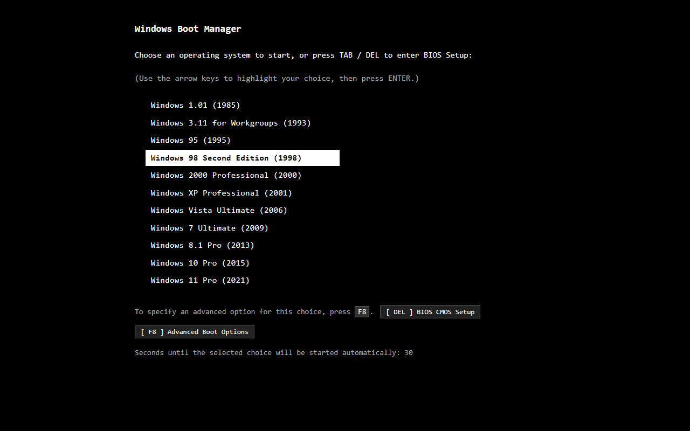

# test-web

Static HTML/CSS/JS simulator of Windows operating systems. No build step, no dependencies.



## How it works

Open `index.html` to load the boot manager and select a Windows version. Each version runs entirely in the browser using plain HTML, CSS, and JavaScript.

## Versions

- Windows 1.01 (1985) - CGA tiled desktop, MS-DOS Executive, Reversi
- Windows 3.11 (1993) - Program Manager, File Manager, Solitaire, Paintbrush
- Windows 95 (1995) - Start menu, FreeCell, Minesweeper, MS-DOS Prompt
- Windows 98 SE (1998) - Active Desktop, Media Player, Internet Explorer 4
- Windows 2000 (2000) - MMC console, Registry Editor, Task Manager
- Windows XP (2001) - Luna theme, 3D Pinball Space Cadet, MSN Messenger 6
- Windows Vista (2006) - Aero glass, Sidebar gadgets, Windows Media Center
- Windows 7 (2009) - Superbar, Aero Snap, Snipping Tool, Sticky Notes
- Windows 8.1 (2013) - Modern UI Start Screen, Live Tiles, Charms Bar
- Windows 10 (2015) - Fluent Design, Cortana, Action Center, dark/light mode
- Windows 11 (2021) - Centered taskbar, Snap Layouts, Copilot AI sidebar

## Running locally

```
python -m http.server 8000
```

Then open http://localhost:8000/.

## Deploying to GitHub Pages

Push to `main` or `master` and the workflow in `.github/workflows/pages.yml` will deploy automatically. Enable GitHub Pages in repo settings with source set to GitHub Actions.
